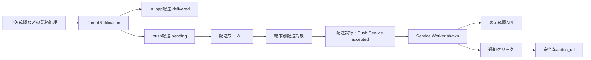

# 保護者向けプッシュ通知機能仕様書

- 対象リポジトリ: open-hoikuict
- ステータス: Draft
- 作成日: 2026-08-12
- 実装状況: 一部基盤あり・プッシュ配送は未実装（計画）
- 初期対象: 出欠未確認時の保護者確認依頼
- 関連: 保護者ポータル、保護者アカウント、出欠確認、認証、セキュリティ

> `ParentNotification`、`ParentNotificationDelivery`、アプリ内通知、プッシュ配送のキュー作成ヘルパは既に存在する。一方、ブラウザ購読、Service Worker、実送信ワーカー、端末別配送結果、開発用確認画面は未実装である。本書で「追加する」と記載するモデル、URL、状態は実装案であり、現行機能として扱わない。

---

## 1. 背景と目的

### 1.1 背景

保護者への確認依頼は、保護者ポータル内のアプリ内通知だけでは、保護者がポータルを開くまで気づけない。特に出欠未確認のような当日対応が必要な連絡では、ブラウザを開いていない状態でも端末へ通知できる手段が必要である。

現行実装には以下の基盤がある。

- `ParentNotification` に通知種別、タイトル、本文、遷移先、通知元、既読状態を保存できる
- `ParentNotificationDelivery` に `in_app` と `push` のチャネルを保存できる
- 出欠未確認時に、職員の明示操作で対象園児に紐づく有効な保護者へアプリ内通知を作成できる
- 同じ通知に対してプッシュ配送を `pending` で作成する `queue_push_delivery()` がある

一方、現行の保護者認証はモックバックエンドのみである。本番プッシュ通知を有効化する前に、保護者を継続的かつ安全に識別できる本番用認証バックエンドが必要である。

### 1.2 目的

- 保護者が許可した端末へ、重要な保護者向け通知をWeb Pushで届ける
- アプリ内通知を正本とし、プッシュ通知を追加の配送チャネルとして扱う
- 通知生成と外部送信を分離し、送信障害が業務処理を失敗させないようにする
- 開発環境で外部への誤送信を防ぎながら、疑似配送と実端末配送の双方を確認できるようにする
- 「キュー登録」「Push Service受理」「ブラウザ表示」「クリック」を区別して追跡する
- 将来、通知種類やFCM/APNs等の配送方式を追加できる構造にする

### 1.3 基本方針

- 通知本文と既読状態は `ParentNotification` を正本とする
- Push Serviceの成功応答だけを「端末表示済み」と扱わない
- 1保護者アカウントに複数端末を登録できるようにする
- ロック画面に園児名、病名、体温、欠席理由等の機微情報を表示しない
- 保護者による明示的な許可操作なしにブラウザの通知権限を要求しない
- developmentの既定値では外部ネットワークへプッシュ送信しない
- 通知作成トランザクションと外部送信を分離し、未送信データをDBに残す
- 初期実装では標準のWeb PushとVAPIDを利用し、Firebase固有SDKを必須としない

---

## 2. スコープ

### 2.1 Phase 1の対象

Phase 1では、現行の出欠確認画面から作成される「本日の出欠確認のお願い」だけを実送信対象とする。

Phase 1で行うこと:

- 保護者ポータルへのWeb App Manifest追加
- 保護者ポータル配下のService Worker追加
- 保護者のブラウザ購読登録、更新、解除
- 通知種類単位の基本設定
- `ParentNotification` 作成時のプッシュ配送キュー登録
- DBを利用した配送ワーカー
- VAPIDによるWeb Push送信
- 端末単位の配送対象と送信試行記録
- Push Service受理、ブラウザ表示、通知クリックの記録
- development限定のcapture配送と確認画面
- developmentでのテスト端末限定実送信
- 無効購読の自動停止と一時障害の再試行

### 2.2 Phase 1対象外

- SMS、メール、LINE等への配送
- ネイティブiOS/Androidアプリ専用のAPNs/FCM実装
- 職員向けプッシュ通知
- 園からのお知らせ、アンケート、日次連絡返信等の自動プッシュ
- 通知文面の園別編集画面
- 施設横断の一斉配信
- 配信日時の予約
- 複雑な曜日別・時間帯別通知設定
- Push Serviceが提供しない「人が実際に読んだこと」の保証

### 2.3 後続候補

配送基盤の安定後、以下を通知種別ごとに追加検討する。

| 通知候補 | 優先度 | 備考 |
| --- | --- | --- |
| 園からのお知らせ公開 | 高 | 公開対象と公開期間の判定が必要 |
| 日次連絡への園返信 | 高 | 本文はプッシュに載せない |
| アンケート開始・締切前 | 中 | 同一アンケートの重複抑止が必要 |
| プロフィール変更申請の結果 | 中 | 審査結果の詳細はポータルで表示 |
| 請求確定 | 低 | 金額等の表示範囲を別途検討 |

---

## 3. 用語

| 用語 | 定義 |
| --- | --- |
| アプリ内通知 | 保護者ポータル内に保存・表示される `ParentNotification` |
| プッシュ配送 | アプリ内通知を端末へ知らせる追加チャネル |
| 購読 | ブラウザが発行したPush endpointと暗号鍵を保護者アカウントへ登録した状態 |
| Push Service | ブラウザが選択し、Web Pushメッセージを端末へ中継するサービス |
| 配送 | 1件のアプリ内通知を1チャネルへ届ける処理単位 |
| 配送対象 | 1件のプッシュ配送を1つの購読端末へ届けるための端末別ジョブ |
| 配送試行 | 1つの配送対象に対する1回の外部HTTP送信。再試行ごとに追加する |
| capture配送 | 外部へ送らず、送信予定内容と結果を開発用画面に記録する配送方式 |
| 表示確認 | Service Workerが `showNotification()` を完了し、確認APIへの送信に成功した状態 |

---

## 4. 全体構成



### 4.1 通知生成と配送の分離

業務処理は次だけを同一DBトランザクションで行う。

1. `ParentNotification` を作成する
2. `in_app` 配送を `delivered` で作成する
3. 通知種類がプッシュ対象の場合、`push` 配送を `pending` で作成する
4. 業務データとともにコミットする

Push ServiceへのHTTPリクエストは、このトランザクション内では行わない。外部送信に失敗しても、出欠確認履歴やアプリ内通知は正常に保存される。

### 4.2 冪等性

- `ParentNotification` は現行の `parent_account_id + source_type + source_id` の一意制約を維持する
- 同一通知・同一チャネルの `ParentNotificationDelivery` は1件とする
- 同一配送・同一購読の配送対象は1件とする
- 同一配送対象・同一試行番号の配送試行は1件とする
- 表示確認とクリック確認APIは、同じイベントを複数回受信しても成功を返す

---

## 5. 通知対象と通知設定

### 5.1 通知対象

Phase 1では、対象園児に紐づく `active` 状態の保護者アカウントすべてにアプリ内通知を作成する。これは現行動作を維持する。

各保護者について、プッシュ通知設定が有効で、かつ有効な購読端末がある場合に、その保護者の全有効端末へ配送する。

### 5.2 通知設定

保護者アカウント単位で次を管理する。

| 項目 | Phase 1既定値 | 説明 |
| --- | --- | --- |
| プッシュ通知全体 | ON | 実際の配送には端末側の許可も必要 |
| 出欠確認依頼 | ON | Phase 1対象 |

ブラウザの通知権限が拒否されている場合、サーバー側設定がONでも配送できない。画面では両者を区別して表示する。

### 5.3 有効期限

出欠確認依頼の配送有効期限は、通知対象日の当日終了時刻または通知作成から6時間後の早い方とする。期限後は再試行せず `expired` とする。

---

## 6. 保護者側の購読管理

### 6.1 設定画面

保護者ポータルに `/parent-portal/push-settings` を追加する。

表示項目:

- このブラウザがWeb Pushに対応しているか
- ブラウザの通知権限: 未確認 / 許可 / 拒否
- この端末の登録状態
- 登録日時と最終確認日時
- 通知種類ごとのON/OFF
- 「この端末で通知を受け取る」ボタン
- 「この端末の通知を解除する」ボタン
- テスト通知の送信ボタン
- iPhone/iPadで必要となるホーム画面追加の案内

### 6.2 許可取得

- ページ表示時に自動で `Notification.requestPermission()` を呼ばない
- 保護者が「この端末で通知を受け取る」を押したイベント内で許可を要求する
- 拒否された場合は再要求を繰り返さず、ブラウザ設定から変更する案内を表示する
- 許可後、Service Workerを登録し、VAPID公開鍵を使って購読を作成する

### 6.3 Service Workerとスコープ

- Service Worker URL案: `/parent-portal/push-service-worker.js`
- スコープ: `/parent-portal/`
- Web App Manifest URL案: `/parent-portal/manifest.webmanifest`
- Service Workerレスポンスは `Cache-Control: no-cache` とする
- Service Workerは保護者ポータルだけを対象とし、職員画面へ影響させない

### 6.4 複数端末

- 同一保護者はスマートフォン、PC等の複数端末を登録できる
- 同じendpointはシステム内で一意とする
- endpointが別の保護者に登録済みの場合、無確認で付け替えない
- 現在の保護者が再登録を明示した場合、旧紐づけを無効化したうえで新しい紐づけを作成し、監査可能な記録を残す

### 6.5 ログアウトとアカウント無効化

- 本節の「ログアウト」は、保護者がログアウトボタン等から明示的にログアウト操作を実行した場合だけを指す
- 明示的なログアウト時は、現在のブラウザ購読を無効化する
- ブラウザ側の `unsubscribe()` が失敗しても、サーバー側購読は無効化する
- セッションの有効期限切れ、認証Cookieの自然消失、ブラウザ終了、長期間ポータルを開いていないことだけを理由に購読を無効化しない
- 購読の有効期間はログインセッションから独立させる。セッション失効後も、有効な保護者アカウントに紐づく有効購読には通知を配送する
- セッション失効中に通知がクリックされた場合は、ログイン後に安全な通知詳細URLへ戻す
- 保護者アカウントが `active` 以外になった場合、そのアカウントの全購読を配送対象外とする
- `404` または `410` 等で購読消失が確認された場合、その購読を自動で無効化する

### 6.6 購読更新

ブラウザによる購読変更に備え、`pushsubscriptionchange` を処理する。自動更新できない場合は旧購読を無効化し、次回ポータル表示時に再登録案内を表示する。

---

## 7. 通知ペイロード

### 7.1 Phase 1ペイロード

```json
{
  "schema_version": 1,
  "notification_id": 123,
  "target_id": 456,
  "kind": "attendance_confirmation_request",
  "title": "保育園から確認のお願い",
  "body": "確認が必要な連絡があります。保護者ポータルをご確認ください。",
  "action_url": "/parent-portal/notifications/123",
  "shown_receipt_token": "opaque-single-purpose-token",
  "clicked_receipt_token": "another-opaque-single-purpose-token",
  "expires_at": "2026-08-12T15:00:00Z"
}
```

### 7.2 表示内容

ロック画面に表示するタイトルと本文は、通知種類ごとに固定された安全な文面を使用する。

含めない情報:

- 園児氏名
- 生年月日、クラス名
- 病名、症状、体温、服薬情報
- 欠席理由
- 保護者氏名、メールアドレス、電話番号
- 職員氏名
- 自由入力された連絡本文

詳細は認証後の保護者ポータルで表示する。

### 7.3 遷移先

- `action_url` は `/parent-portal/` 配下の相対URLだけを許可する
- Service Workerは外部URL、スキーム相対URL、バックスラッシュを含むURLを開かない
- 既存ウィンドウがある場合はフォーカスして遷移し、なければ新しいウィンドウを開く
- 未認証の場合はログイン後に安全な内部URLへ戻す

---

## 8. 配送状態

### 8.1 プッシュ配送の集約状態

`ParentNotificationDelivery.status` は、端末別結果のうち確認できた最高到達度を表示するための集約値とする。ワーカーの取得条件や配送全体の完了判定には使用しない。

| 状態 | 集約上の意味 |
| --- | --- |
| `pending` | 端末展開前、または成功到達のない未処理・再試行待ち端末がある |
| `processing` | 成功到達はなく、少なくとも1端末を処理中 |
| `accepted` | 少なくとも1端末についてPush Serviceが受理 |
| `shown` | 少なくとも1端末で表示確認を受信 |
| `clicked` | 少なくとも1端末でクリック確認を受信 |
| `failed` | 成功到達がなく、全対象端末が終端失敗 |
| `suppressed` | 設定OFF、対象購読なし、または全対象端末が抑止 |
| `expired` | 成功到達がなく、全対象端末が期限切れ |

`accepted` は端末表示の保証ではない。画面上では「送信サービス受付」と表示し、「端末表示」と区別する。

集約状態が `accepted / shown / clicked` であっても、別端末に `pending / processing / retry_wait` が残っている場合がある。そのため、これらを配送全体の終端状態とはみなさない。

配送全体の外部送信処理が完了した条件は、端末展開が完了し、`pending / processing / retry_wait` の配送対象が0件になったことである。この時刻を `ParentNotificationDelivery.completed_at` に保存する。表示確認やクリック確認は外部送信完了後にも到着し得るため、`completed_at` 後も集約状態を `shown / clicked` へ進めてよい。

### 8.2 端末別配送対象の状態

`ParentPushDeliveryTarget` には `pending / processing / accepted / shown / clicked / retry_wait / failed / suppressed / expired` を記録する。

ワーカーが取得する未完了状態は `pending / processing / retry_wait` である。`processing` はlease切れの場合だけ再取得できる。`accepted / shown / clicked / failed / suppressed / expired` は、その端末に対する外部送信上の終端状態とする。

集約配送状態は配送対象の状態から次の優先順で更新する。

1. 1端末以上が `clicked` なら `clicked`
2. 1端末以上が `shown` なら `shown`
3. 1端末以上が `accepted` なら `accepted`
4. 1端末以上が `processing` なら `processing`
5. `pending` または `retry_wait` があれば `pending`
6. 配送対象が0件、または全端末が `suppressed` なら `suppressed`
7. 全端末が `expired` なら `expired`
8. それ以外で全端末が終端し、成功到達がなければ `failed`

この優先順は表示用の到達度だけを決める。再試行可否は必ず各 `ParentPushDeliveryTarget.status`、`next_retry_at`、`lease_expires_at` から判定する。

例として、端末1が `accepted`、端末2が `retry_wait` の場合、配送の集約状態は `accepted` だが `completed_at` は未設定である。ワーカーは配送の `accepted` を参照せず、端末2のTargetを `next_retry_at` 以降に再取得する。

---

## 9. データモデル案

### 9.1 `ParentPushSubscription`

| フィールド | 型の目安 | 必須 | 説明 |
| --- | --- | --- | --- |
| `id` | integer | 必須 | 主キー |
| `parent_account_id` | integer | 必須 | 保護者アカウント |
| `endpoint` | text | 必須 | Push endpoint。通常ログへ出力しない |
| `endpoint_hash` | string | 必須 | endpoint重複判定用。システム内で一意 |
| `p256dh_key` | text | 必須 | ペイロード暗号化用公開鍵 |
| `auth_key` | text | 必須 | 購読認証secret |
| `status` | enum | 必須 | `active / revoked / expired` |
| `device_label` | string | 任意 | 保護者が識別できる端末名 |
| `user_agent` | string | 任意 | 長さを制限して保存 |
| `environment` | string | 必須 | `development / production / test` |
| `is_test_device` | boolean | 必須 | development実送信の許可対象 |
| `failure_count` | integer | 必須 | 連続失敗回数 |
| `created_at` | datetime | 必須 | 登録日時 |
| `updated_at` | datetime | 必須 | 更新日時 |
| `last_seen_at` | datetime | 任意 | ポータルまたは受信確認の最終日時 |
| `disabled_at` | datetime | 任意 | 無効化日時 |
| `disabled_reason` | string | 任意 | 機密情報を含めない理由コード |

endpoint、`p256dh_key`、`auth_key` は認証情報に準じて取り扱い、エクスポート対象外とする。

### 9.2 `ParentPushPreference`

| フィールド | 型の目安 | 説明 |
| --- | --- | --- |
| `parent_account_id` | integer | 保護者アカウント |
| `push_enabled` | boolean | 全体設定 |
| `attendance_confirmation_enabled` | boolean | 出欠確認通知設定 |
| `created_at` | datetime | 作成日時 |
| `updated_at` | datetime | 更新日時 |

設定行がない場合はPhase 1既定値を使用し、参照処理が勝手に `commit()` しないようにする。

### 9.3 `ParentPushDeliveryTarget`

| フィールド | 型の目安 | 説明 |
| --- | --- | --- |
| `id` | integer | 主キー |
| `delivery_id` | integer | `ParentNotificationDelivery` |
| `subscription_id` | integer | 対象端末 |
| `status` | enum | 端末別配送状態 |
| `attempt_count` | integer | 実行済み送信試行数 |
| `shown_receipt_token_hash` | string | 表示確認用tokenのハッシュ |
| `clicked_receipt_token_hash` | string | クリック確認用tokenのハッシュ |
| `processing_started_at` | datetime | 現在の処理開始日時 |
| `lease_expires_at` | datetime | 端末別ジョブのlease期限 |
| `attempted_at` | datetime | 送信開始日時 |
| `accepted_at` | datetime | Push Service受理日時 |
| `shown_at` | datetime | 表示確認日時 |
| `clicked_at` | datetime | クリック確認日時 |
| `next_retry_at` | datetime | 次回再試行可能日時 |
| `last_error_code` | string | 最新の安定した内部エラーコード |
| `last_error_message` | string | endpoint等を除去した最新エラー要約 |
| `created_at` | datetime | 作成日時 |
| `updated_at` | datetime | 更新日時 |

`delivery_id + subscription_id` を一意とする。ワーカーの取得、再試行、leaseはこの行を単位とする。

### 9.4 `ParentPushDeliveryAttempt`

配送対象に対する実際の外部HTTP送信を、再試行ごとに追記する。

| フィールド | 型の目安 | 説明 |
| --- | --- | --- |
| `id` | integer | 主キー |
| `target_id` | integer | `ParentPushDeliveryTarget` |
| `attempt_no` | integer | 対象内の送信試行番号 |
| `transport` | enum | `capture / webpush` |
| `result` | enum | `accepted / retryable_failed / terminal_failed` |
| `provider_status_code` | integer | Push ServiceのHTTPステータス |
| `provider_request_id` | string | 取得できる場合だけ保存 |
| `started_at` | datetime | 外部送信開始日時 |
| `completed_at` | datetime | 外部送信終了日時 |
| `error_code` | string | 安定した内部エラーコード |
| `error_message` | string | endpoint等を除去した要約 |
| `created_at` | datetime | 作成日時 |

`target_id + attempt_no` を一意とする。配送試行は履歴であり、再試行スケジューリングには使用しない。

### 9.5 既存モデルの変更

`NotificationDeliveryStatus` に `processing / accepted / shown / clicked / suppressed / expired` を追加する。

`ParentNotificationDelivery` に以下を追加する。

- `expires_at`
- `targets_resolved_at`
- `planning_lease_expires_at`
- `completed_at`
- `accepted_at`
- `shown_at`
- `clicked_at`

`in_app` 配送では現行どおり `delivered` を利用する。`push` 配送の「Push Service受理」には `accepted` を利用し、意味を混在させない。

---

## 10. API仕様案

すべての保護者向け管理APIは、現在ログイン中の有効な保護者アカウントだけを対象とする。他の保護者IDをリクエスト本文から指定させない。

| メソッド | URL案 | 用途 | CSRF |
| --- | --- | --- | --- |
| GET | `/parent-portal/push-settings` | 設定画面 | 不要 |
| GET | `/parent-portal/push/public-key` | VAPID公開鍵取得 | 不要 |
| POST | `/parent-portal/push/subscriptions` | 現在の端末を登録・更新 | 必要 |
| DELETE | `/parent-portal/push/subscriptions/current` | 現在の端末を解除 | 必要 |
| POST | `/parent-portal/push/preferences` | 通知設定更新 | 必要 |
| POST | `/parent-portal/push/test` | 現在の保護者へのテスト通知 | 必要 |
| POST | `/parent-portal/push/receipts/{target_id}/shown` | 表示確認 | 専用token |
| POST | `/parent-portal/push/receipts/{target_id}/clicked` | クリック確認 | 専用token |

### 10.1 購読登録

登録リクエストはPush APIの購読JSONを受け取り、形式、長さ、endpointのHTTPS、鍵の存在を検証する。保存する保護者IDはセッションから決定する。

レスポンスにendpointや鍵を返さない。成功時は端末表示用の識別子と登録状態だけを返す。

### 10.2 表示・クリック確認

- payloadに含めるイベント別の単用途opaque tokenで認証する
- DBにはtokenそのものではなくハッシュを保存する
- それぞれのtokenは対象Targetとイベント種類に結びつける
- `expires_at` 後は受け付けない
- CSRF Cookieや保護者ログイン状態には依存しない
- 同一イベントの再送は冪等に成功させる
- リクエスト・アクセスログにtokenを残さない形式を選ぶ

---

## 11. Service Worker仕様

### 11.1 pushイベント

1. payloadのJSON解析と `schema_version` 検証を行う
2. 不正または期限切れのpayloadを表示しない
3. title、body、tag、data.action_urlを使って `showNotification()` を呼ぶ
4. 表示完了後に `shown` 確認APIを呼ぶ
5. すべてを `event.waitUntil()` 内で待機する

通知の `tag` は通知IDまたは通知種類と業務日を基にし、同じ通知の再試行で通知バナーが重複しないようにする。

### 11.2 notificationclickイベント

1. 通知を閉じる
2. `clicked` 確認APIを呼ぶ
3. `/parent-portal/` スコープの既存ウィンドウを検索する
4. 安全な `action_url` へ遷移してフォーカスする
5. 既存ウィンドウがなければ新しく開く

### 11.3 エラー時

- 表示確認APIへの通信失敗を通知表示の失敗とは扱わない
- Service Worker内でendpoint、鍵、tokenをconsoleへ出力しない
- payload不正は画面へ詳細を出さず、安全に破棄する

---

## 12. 配送ワーカー

### 12.1 実行方式

Phase 1では追加の外部キュー製品を必須にせず、DBをoutboxとして利用する。処理を「配送対象の展開」と「端末別送信」の2段階に分ける。

配送対象の展開処理は、`targets_resolved_at` が未設定の `push` 配送を取得し、その時点で有効な購読ごとに `ParentPushDeliveryTarget` を1件作成する。展開完了後に `targets_resolved_at` を設定する。購読が後から追加されても、過去の配送へ遡ってTargetを追加しない。

端末別送信ワーカーは、次のいずれかを満たす `ParentPushDeliveryTarget` を取得する。

- `status == pending`
- `status == retry_wait` かつ `next_retry_at <= now`
- `status == processing` かつ `lease_expires_at < now`

取得時には親の配送と通知をJOINし、有効期限内であることも確認する。`ParentNotificationDelivery.status` は取得条件に使用しない。

本番の初期構成が単一アプリプロセスである間はFastAPI lifespanからワーカーループを起動できる。ただし配送ロジックは独立サービスとして実装し、将来別プロセスへ移動できるようにする。

### 12.2 処理権の取得

- 配送対象の展開時だけ、配送行の `planning_lease_expires_at` を短時間使用する
- `delivery_id + subscription_id` の一意制約により、並行展開でも同じ端末のTargetを重複作成しない
- 外部送信の取得時はTargetを `processing` とし、Targetの `lease_expires_at` を設定する
- Targetのlease期限内は他ワーカーが同じ端末へ送信しない
- プロセス停止後、Targetのlease期限を過ぎた場合だけ再取得できる
- 1回の外部送信開始時に `ParentPushDeliveryAttempt` を追加し、Targetの `attempt_count` を増やす
- 外部送信中にDBトランザクションを長時間保持しない
- Target更新後に配送の集約状態と `completed_at` を再計算する

### 12.3 対象端末決定

Target展開時と各送信試行前に以下を確認する。

1. 保護者アカウントが `active`
2. 通知設定が有効
3. 通知が有効期限内
4. 現在の環境と購読の `environment` が一致
5. 有効な購読が1件以上ある

Target展開時に対象がなければ、配送を理由コード付きで `suppressed` または `expired` にし、`targets_resolved_at` と `completed_at` を設定する。

送信試行前の再確認で対象外になった場合は、そのTargetを `suppressed` または `expired` にする。他のTargetの処理は継続する。

---

## 13. 再試行とエラー処理

| エラー | 処理 |
| --- | --- |
| HTTP 404 / 410 | 購読を無効化し、その端末は終端失敗 |
| HTTP 429 | `Retry-After` を優先して再試行 |
| HTTP 500系 | 指数バックオフで再試行 |
| タイムアウト・一時ネットワーク障害 | 指数バックオフで再試行 |
| HTTP 400 | payloadまたは購読不正として終端失敗 |
| HTTP 401 / 403 | VAPID設定異常として終端失敗し、運用警告対象 |
| 有効期限切れ | `expired`、再試行なし |

Phase 1の最大送信試行回数は5回とする。待機時間の目安は `30秒、2分、10分、30分` とし、通知の有効期限を超えない範囲で適用する。実際の待機には小さなランダム揺らぎを加える。

エラー情報にはendpoint、認証鍵、receipt token、VAPID秘密鍵を含めない。

---

## 14. 開発・テスト環境

### 14.1 配送方式

環境変数 `HOIKUICT_PUSH_TRANSPORT` で配送方式を選択する。

| 値 | 外部送信 | 用途 |
| --- | --- | --- |
| `disabled` | しない | 機能停止。配送は理由付きで抑止 |
| `capture` | しない | payloadと状態を開発確認画面へ記録 |
| `webpush` | する | 実際のPush Serviceへ送信 |

既定値:

- `development`: `capture`
- `test`: `capture`。テスト内ではインメモリtransportへ差し替え可能
- `production`: `disabled`。明示的に `webpush` を指定した場合だけ有効

### 14.2 VAPID設定

実送信には以下を必須とする。

```text
HOIKUICT_PUSH_VAPID_PUBLIC_KEY=
HOIKUICT_PUSH_VAPID_PRIVATE_KEY=
HOIKUICT_PUSH_VAPID_SUBJECT=
HOIKUICT_PUBLIC_ORIGIN=
```

- developmentとproductionでVAPID鍵を共用しない
- 秘密鍵をリポジトリ、DB、画面、通常ログへ保存しない
- `HOIKUICT_PUBLIC_ORIGIN` は購読を作成する実際のHTTPS originと一致させる
- productionで `webpush` の場合、不足設定があれば起動を拒否する

### 14.3 development実送信の安全策

developmentで `webpush` を使う場合、以下をすべて満たす購読だけへ送信する。

- `environment == development`
- `is_test_device == true`
- 開発用画面から現在ログイン中の保護者自身がテスト端末登録を行っている
- テスト通知または明示的に許可された開発用通知である

developmentの実送信では全保護者一括送信機能を設けない。画面には常時「実プッシュ送信モード」の警告を表示する。

### 14.4 開発用確認画面

development限定で `/dev/push-notifications` を追加する。productionではrouter自体を登録せず404とする。

表示項目:

- 通知ID、通知種類、作成時刻
- 個人情報を最小化した対象保護者表示
- capture / webpushの区別
- 対象端末のテスト端末名
- `pending / accepted / shown / clicked / failed` の各時刻
- Push ServiceのHTTPステータス
- 試行回数、次回再試行時刻、秘匿済みエラー理由
- payloadプレビュー。endpoint、鍵、tokenは表示しない

操作:

- 現在ログイン中のテスト保護者端末への一意なテスト通知作成
- capture通知の内容確認
- 失敗理由の確認
- 無効購読の確認

### 14.5 実送信確認手順

1. `HOIKUICT_ENV=development` と開発用VAPID鍵を設定する
2. HTTPSの安定した開発origin、または対応ブラウザのlocalhostでアプリを開く
3. モック保護者としてログインする
4. 通知設定画面から現在の端末をテスト端末として登録する
5. `HOIKUICT_PUSH_TRANSPORT=webpush` でテスト通知を送る
6. 開発用確認画面で `accepted` を確認する
7. 端末に通知が表示され、`shown` が記録されることを確認する
8. 通知をクリックし、`clicked` と正しい保護者ポータル画面への遷移を確認する

テスト通知のタイトルには一意な短い確認コードを付け、目視した通知とDB上の配送を照合できるようにする。

---

## 15. セキュリティとプライバシー

### 15.1 認証前提

- 購読登録・解除・通知設定変更には有効な保護者ログインを必須とする
- 本番用 `ParentPortalAuthBackend` が未実装の間はproductionのWeb Pushを有効化しない
- 他の保護者のアカウントIDや購読IDを指定して操作できないようにする

### 15.2 機密情報

次をsecretとして扱う。

- VAPID秘密鍵
- Push endpoint
- `p256dh` と `auth` の購読鍵
- 表示・クリック確認token

これらは通常ログ、監査画面、エラーメッセージ、capture payloadプレビューへ出力しない。

### 15.3 HTTPS

productionはHTTPSを必須とする。`HOIKUICT_PUBLIC_ORIGIN` がHTTPSでない場合、productionのWeb Pushを有効化しない。

### 15.4 CSRFと確認API

購読管理と通知設定変更は既存のCSRF保護対象とする。Service Workerからの表示・クリック確認はCookie認証やCSRF tokenに依存させず、短命な単用途tokenを使用する。

### 15.5 監査

保護者の通知設定変更、購読の登録・解除・別アカウントからの付け替え、職員による業務通知作成は、誰がいつ行ったか追跡できるようにする。

---

## 16. 運用・可観測性

### 16.1 管理指標

少なくとも以下を日単位で確認できるようにする。

- 通知作成件数
- プッシュ対象件数
- 対象購読なし件数
- Push Service受理件数
- 表示確認件数
- クリック件数
- 終端失敗件数
- HTTP 404 / 410による購読無効化件数
- 再試行待ち件数と最古の待機時間

### 16.2 ログ

構造化ログには通知ID、配送ID、Target ID、試行ID、通知種類、状態、内部エラーコードを含める。保護者氏名、メールアドレス、園児情報、endpoint、鍵、tokenは含めない。

### 16.3 保存期間

- `ParentNotification` と既読情報は既存の通知保存方針に従う
- 端末別配送試行の詳細は原則90日保持する
- 90日経過後は集計に必要な非個人情報だけを残して削除できる
- 無効購読は監査上必要な最小情報を残し、endpointと鍵を削除または復元不能にする

---

## 17. 画面表示

### 17.1 保護者向け表示文言

| 状態 | 表示例 |
| --- | --- |
| 未登録 | この端末ではプッシュ通知を受け取っていません |
| 許可済み・登録済み | この端末で通知を受け取ります |
| ブラウザ拒否 | ブラウザの通知設定で許可してください |
| 非対応 | このブラウザではプッシュ通知を利用できません |
| 再登録必要 | 通知の登録を更新してください |

### 17.2 職員向け表示

出欠確認画面の職員操作では、Phase 1において「保護者へ連絡」の操作を維持する。完了表示は次のように区別する。

- アプリ内通知作成成功: 「保護者ポータルへ通知しました」
- プッシュキュー登録済み: 「端末通知はバックグラウンドで送信されます」
- 対象保護者なし: 現行どおり対象がないことを表示

外部送信完了を同期レスポンスで保証する表現は使用しない。

---

## 18. テスト仕様

### 18.1 単体テスト

- 通知種類と設定からプッシュ対象を正しく判定する
- 同じ通知へプッシュ配送を重複作成しない
- 同じendpointを重複登録しない
- 別保護者のendpointを無確認で付け替えない
- payloadに禁止情報を含めない
- `action_url` の外部URLや不正形式を拒否する
- 配送対象から集約状態と `completed_at` を正しく計算する
- 1端末が `accepted`、別端末が `retry_wait` の場合も、集約状態にかかわらず後者を再試行する
- 404 / 410、429、500系、タイムアウトの処理が仕様どおりである
- 有効期限後に送信・再試行しない
- receipt tokenのハッシュ照合、期限、イベント種別を検証する

### 18.2 統合テスト

- 出欠確認更新と同一トランザクションでアプリ内通知・プッシュ配送を作成する
- 業務トランザクションのロールバック時に配送だけ残らない
- capture transportで外部通信せず配送内容を確認できる
- fake transportの成功で `accepted` になる
- 一時失敗後に再試行される
- lease期限前の二重処理を防止する
- lease期限後に処理を回復できる
- 無効購読が配送対象外になる
- 保護者アカウント無効化後に送信されない
- 明示的なログアウト操作で現在端末の購読が無効化される
- セッション有効期限切れだけでは購読が無効化されない

### 18.3 ブラウザ実機確認

- 対応PCブラウザで購読、受信、表示、クリック、解除ができる
- Androidの対応ブラウザで同じ確認ができる
- iPhone/iPadのホーム画面Webアプリで同じ確認ができる
- ブラウザを閉じた状態でも通知を受信できる
- 通知クリック後、認証状態に応じて安全に遷移する
- 通知権限拒否時に適切な案内が出る
- 明示的なログアウト後の端末へ新規通知が送られない
- セッション有効期限切れ後も購読が維持され、通知を受信できる
- セッション有効期限切れ後に通知をクリックすると、再ログイン後に通知詳細へ戻る

---

## 19. 受入条件

Phase 1は以下をすべて満たしたとき完了とする。

- [ ] developmentの既定状態では外部へプッシュ送信しない
- [ ] capture画面で送信予定payloadと状態遷移を確認できる
- [ ] 開発用テスト端末に実送信できる
- [ ] `pending / accepted / shown / clicked` の各段階を区別して確認できる
- [ ] 1保護者の複数端末を個別に追跡できる
- [ ] 同一業務イベントから通知と配送が重複作成されない
- [ ] Push Service障害が出欠確認の保存を失敗させない
- [ ] 無効な購読を自動停止できる
- [ ] 一時障害を有効期限内で再試行できる
- [ ] プッシュ本文、画面、ログに禁止された個人情報を含めない
- [ ] 他の保護者の購読を登録・解除・閲覧できない
- [ ] productionで鍵、HTTPS、本番保護者認証が不足している場合はWeb Pushを有効化できない
- [ ] 明示的なログアウトでは現在端末の購読を無効化し、セッション有効期限切れでは無効化しない
- [ ] 自動テストとPC・Android・iPhone/iPadの実機確認手順が整備されている

---

## 20. 実装順序

### Step 1: 配送基盤とcapture

- 状態enumとデータモデル追加
- transportインターフェース追加
- capture transport追加
- 出欠確認通知からプッシュ配送をキュー登録
- 単体・統合テスト追加

### Step 2: ブラウザ購読

- Manifest、アイコン、Service Worker追加
- 保護者向け通知設定画面追加
- 購読登録・解除API追加
- 複数端末とログアウト処理追加

### Step 3: 実Web Push

- VAPID設定と起動時検証追加
- Web Push transport追加
- 配送ワーカー、lease、再試行追加
- 無効購読の自動停止追加

### Step 4: 配送確認と運用

- 表示・クリック確認API追加
- development確認画面追加
- 実端末確認手順整備
- 運用指標と保存期間処理追加

---

## 21. 実装前に確定する事項

以下は本書の推奨初期値であり、実装着手時にプロジェクト判断として確定する。

| 論点 | 推奨初期値 |
| --- | --- |
| Phase 1通知種類 | 出欠確認依頼のみ |
| 通知対象 | 紐づく有効保護者全員の有効端末 |
| ロック画面の園児名 | 表示しない |
| development既定transport | `capture` |
| production既定transport | `disabled` |
| 最大送信試行回数 | 5回 |
| 出欠確認通知の有効期限 | 当日終了または6時間後の早い方 |
| 配送試行詳細の保存期間 | 90日 |
| 明示的なログアウト時 | 現在端末の購読を無効化 |
| セッション有効期限切れ時 | 購読を維持 |

---

## 22. 参照

- [W3C Push API](https://www.w3.org/TR/push-api/)
- [Apple: Sending web push notifications in web apps and browsers](https://developer.apple.com/documentation/usernotifications/sending-web-push-notifications-in-web-apps-and-browsers)
- `models.py`: `ParentNotificationKind`、`NotificationDeliveryChannel`、`NotificationDeliveryStatus`、`ParentNotification`、`ParentNotificationDelivery`
- `parent_notification_service.py`: アプリ内通知作成とプッシュ配送キュー作成ヘルパ
- `routers/attendance_checks.py`: 出欠確認時の保護者通知作成
- `routers/parent_portal.py`: 保護者ポータルとアプリ内通知表示
- `auth.py`: 保護者ポータル認証バックエンド
- `security_config.py`: 環境別セキュリティ設定とproduction起動時検証
